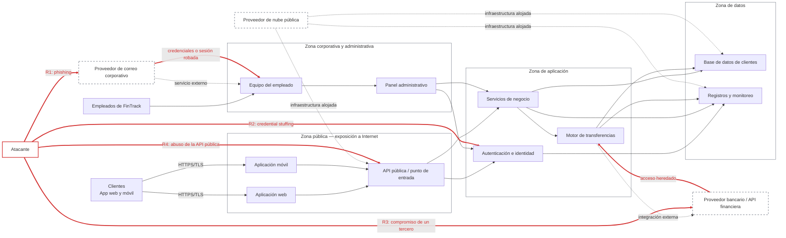

# 02 — Arquitectura y Superficie de Ataque

**Decisión que permite tomar este documento:** identificar los límites de confianza, los componentes más expuestos y los puntos donde FinTrack debe priorizar controles de identidad, acceso, terceros y monitoreo.

Este documento acompaña el análisis del caso de negocio y representa una arquitectura lógica. Las zonas indican distintos niveles de acceso y sensibilidad; no implican necesariamente redes físicas separadas.

---

## Diagrama de la arquitectura

### Lectura del diagrama

- La aplicación web, la aplicación móvil y la API están expuestas a Internet y concentran el acceso de clientes.
- La autenticación controla el ingreso a los servicios internos, pero una identidad comprometida puede atravesar varias zonas sin explotar directamente la infraestructura.
- El panel administrativo amplía el impacto potencial de una cuenta interna comprometida.
- El correo, el proveedor bancario y la nube son terceros: FinTrack depende de ellos, pero no controla completamente su seguridad.
- Los caminos rojos representan las entradas más probables para un atacante y se convertirán en riesgos formales dentro de `03-risk-analysis/`.

---

## Componentes

| # | Componente | Qué hace | Pilar CID | ¿Dónde puede fallar? |
|---|------------|----------|-----------|----------------------|
| 1 | Aplicación web y móvil | Permite a los clientes consultar movimientos, categorizar gastos y programar transferencias. | Confidencialidad, integridad y disponibilidad | Robo de sesión, manejo inseguro de tokens, validación deficiente de entradas o indisponibilidad del servicio. |
| 2 | API pública | Recibe las solicitudes de las aplicaciones y las dirige hacia los servicios internos. | Confidencialidad e integridad | Autorización incorrecta, endpoints expuestos, ausencia de límites de solicitudes o acceso a datos de otro usuario. |
| 3 | Autenticación e identidad | Verifica usuarios, credenciales, sesiones y permisos. | Confidencialidad | Falta de MFA, contraseñas reutilizadas, sesiones no revocadas o accesos desde ubicaciones y dispositivos anómalos. |
| 4 | Servicios de negocio | Procesan las funciones principales de FinTrack y conectan la API con los datos. | Integridad y disponibilidad | Permisos excesivos, dependencias vulnerables, errores de lógica o comunicación insegura entre servicios. |
| 5 | Motor de transferencias | Valida y ejecuta operaciones que pueden mover dinero real. | Integridad y disponibilidad | Transferencias no autorizadas, manipulación de montos o destinatarios, abuso de cuentas con privilegios y fallas del proveedor bancario. |
| 6 | Base de datos de clientes | Almacena perfiles, información financiera vinculada y registros de operaciones. | Confidencialidad e integridad | Acceso excesivo, exposición de datos, consultas inseguras, copias de seguridad sin protección o eliminación accidental. |
| 7 | Registros y monitoreo | Conserva evidencia de accesos, acciones y errores para detectar e investigar incidentes. | Integridad y disponibilidad | Logs incompletos, falta de alertas, retención insuficiente, registros modificables o ausencia de centralización. |
| 8 | Panel administrativo | Permite al personal autorizado gestionar usuarios, operaciones y configuraciones. | Confidencialidad e integridad | Acceso con cuentas robadas, privilegios excesivos, exposición directa a Internet o cuentas compartidas. |
| 9 | Equipos y correo corporativo | Permiten al personal trabajar y comunicarse con clientes y proveedores. | Confidencialidad | Phishing, malware, robo de cookies, reglas de reenvío externas o dispositivos no administrados. |
| 10 | Proveedores externos | Aportan correo, infraestructura en nube e integración bancaria. | Según el servicio | Compromiso de credenciales de integración, fallas del proveedor, configuraciones inseguras o interrupciones fuera del control directo de FinTrack. |

---

## La superficie de ataque en una frase

> La mayor exposición de FinTrack está en las identidades que atraviesan la API, el correo, el panel administrativo y las integraciones externas; por eso su perímetro real no es la red, sino el acceso.

---

## Caminos de entrada más probables

1. **Phishing contra un empleado de Finanzas → correo corporativo → robo de credenciales o sesión → panel administrativo y servicios internos.** Corresponde a **R1: compromiso de identidad interna**, y ya se materializó en el incidente que originó la evaluación.
2. **Credenciales reutilizadas o filtradas de un cliente → servicio de autenticación → API → datos financieros o funciones de transferencia.** Corresponde a **R2: acceso no autorizado a cuentas de clientes mediante credential stuffing**.
3. **Compromiso de un proveedor o de una credencial de integración → conexión externa → motor de transferencias o datos.** Corresponde a **R3: riesgo de cadena de suministro e integraciones de terceros**.

Los identificadores R1–R3 se conservarán en `03-risk-analysis/risk-register.md`. Los riesgos R4–R6 se completarán allí para cubrir abuso de la API, interrupción por malware o ransomware y deficiencias de monitoreo y respuesta.

---

## Implicación para los controles

El orden inicial de protección debe ser: **identidad y MFA**, **mínimo privilegio en el panel administrativo**, **protección de la API**, **control de integraciones externas** y **centralización de logs con alertas básicas**. Este orden reduce primero los caminos de entrada más probables y puede ser sostenido por el equipo de TI de cuatro personas definido en el caso de negocio.

---
