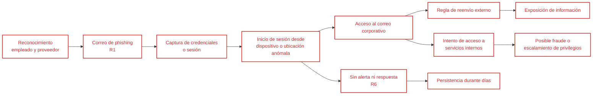

# 03 — Modelo de Amenazas

**Decisión que permite tomar este documento:** identificar los atacantes, vectores y activos más expuestos para concentrar los controles de FinTrack en amenazas realistas.

---

## ¿Quién atacaría a FinTrack?

| Actor | Motivación | ¿Aplica? | Razonamiento |
|-------|------------|----------|--------------|
| Ciberdelincuentes financieros | Robar credenciales, datos o dinero. | Sí — alta prioridad | FinTrack procesa información financiera y transferencias. El incidente de phishing demuestra que una cuenta interna puede ser un punto de entrada rentable. |
| Operadores de phishing y robo de credenciales | Capturar contraseñas, sesiones y correos corporativos. | Sí — alta prioridad | Pueden suplantar proveedores conocidos y atacar a empleados de Finanzas sin explotar la infraestructura. |
| Operadores de credential stuffing | Probar credenciales filtradas de otros servicios contra cuentas de clientes. | Sí | La aplicación tiene aproximadamente 28.000 clientes y un acceso expuesto a Internet, lo que permite automatizar intentos. |
| Afiliados de ransomware | Cifrar sistemas y exigir un pago. | Sí | El correo, los equipos de empleados y los servicios en nube ofrecen rutas posibles de entrada y propagación. |
| Atacante mediante un proveedor comprometido | Usar accesos, secretos o integraciones de un tercero. | Sí | FinTrack depende de correo, nube pública y una API bancaria; hereda parte del riesgo de esos proveedores. |
| Empleado interno malicioso | Consultar, modificar o extraer información aprovechando permisos legítimos. | Sí — menor probabilidad | El acceso interno puede causar daño si existen privilegios excesivos o registros insuficientes. |
| Actor estatal avanzado | Espionaje o sabotaje estratégico. | No se prioriza | No existe evidencia de que FinTrack sea un objetivo estratégico. Los recursos deben dirigirse primero a amenazas más probables y observadas. |

> **Perfil del atacante realista de FinTrack:** ciberdelincuente con motivación económica que utiliza phishing, credenciales filtradas y automatización básica. No necesita una vulnerabilidad avanzada; busca una identidad válida para acceder al correo, la API o funciones internas.

---

## ¿Por dónde entraría? (cadena de ataque)

La cadena más probable reproduce el patrón del incidente que originó la evaluación.

El punto crítico no es únicamente el correo: es la identidad válida que permite atravesar controles y mantener acceso sin generar alertas.

---

## ¿Qué puede salir mal? (por activo)

| Activo | Amenaza concreta | Vector realista | Riesgo asociado |
|--------|------------------|-----------------|-----------------|
| **A1 — Base de datos de clientes** | Exposición o extracción de información financiera. | Cuenta comprometida, autorización deficiente en la API o acceso heredado de un tercero. | R1, R3, R4 |
| **A2 — Motor de transferencias** | Transferencias no autorizadas o manipulación de operaciones. | Sesión robada, cuenta de cliente comprometida o credencial de integración expuesta. | R1, R2, R3 |
| **A3 — Plataforma web y móvil** | Interrupción, abuso automatizado o acceso indebido. | Credential stuffing, abuso de endpoints, malware o ransomware. | R2, R4, R5 |
| **A4 — Credenciales y sesiones de empleados** | Robo de identidad interna y persistencia del atacante. | Phishing, robo de cookies, contraseñas reutilizadas o dispositivos no administrados. | R1 |
| **A5 — Integraciones con terceros** | Uso indebido de accesos que FinTrack no controla completamente. | Compromiso del proveedor, secretos sin rotación o permisos excesivos. | R3 |
| **A1–A5 — Evidencia operativa** | Incidentes no detectados o imposibles de investigar. | Logs incompletos, sin centralización, alertas o responsables definidos. | R6 |

---

## Cómo calificas el riesgo

> **Riesgo = Probabilidad × Impacto**, mediante una escala cualitativa defendida con evidencia del caso.

### Probabilidad

- **Alta:** el evento ya ocurrió, existen controles ausentes o el ataque puede automatizarse fácilmente.
- **Media:** el escenario es viable y los activos están expuestos, pero no existe evidencia de que se haya materializado.
- **Baja:** requiere capacidades especializadas, acceso poco probable o condiciones que no corresponden al contexto actual.

### Impacto

- **Alto:** puede provocar fraude, exposición de datos financieros, interrupción crítica o pérdida de confianza.
- **Medio:** afecta una función limitada y puede contenerse sin impacto generalizado.
- **Bajo:** produce una afectación menor, reversible y sin exposición relevante.

### Nivel resultante

| Probabilidad | Impacto | Nivel |
|--------------|---------|-------|
| Alta | Alto | Crítico |
| Alta | Medio | Alto |
| Media | Alto | Alto |
| Media | Medio | Medio |
| Baja | Alto | Medio |
| Baja | Medio o bajo | Bajo |

Cada nivel del registro se justifica con el tamaño de FinTrack, la exposición del activo, los controles actuales y la evidencia del incidente.

---

## Supuestos del modelo

1. FinTrack mantiene su infraestructura en un solo proveedor de nube pública.
2. El equipo de TI está compuesto por cuatro personas y no existe personal dedicado de seguridad.
3. MFA, acceso condicional y monitoreo de identidad no están aplicados de forma completa.
4. Los registros existen, pero no están centralizados ni generan alertas operativas suficientes.
5. El correo, la nube y la integración bancaria son servicios externos con accesos necesarios para el negocio.
6. No se confirmó pérdida económica en el incidente, pero la falta de evidencia impide descartarla totalmente.
7. La API pública es accesible desde Internet y procesa solicitudes de las aplicaciones web y móvil.

---

## Lo que este modelo descarta

| Amenaza descartada | Razón |
|--------------------|-------|
| Operación dirigida por un actor estatal | Su probabilidad actual es menor que la de phishing, robo de credenciales, abuso de API y ransomware. No justifica controles especializados en esta fase. |
| Ataque físico al centro de datos | La infraestructura está alojada en nube pública y la seguridad física corresponde principalmente al proveedor. FinTrack debe revisar al tercero, no duplicar ese control. |
| Explotación de una vulnerabilidad desconocida de alta complejidad | Es posible, pero no se prioriza frente a rutas conocidas y más baratas para el atacante, como identidades comprometidas y configuraciones débiles. |
| DDoS volumétrico como riesgo independiente | Se considera dentro de la disponibilidad de la plataforma y la dependencia del proveedor, pero no desplaza a los seis riesgos principales por falta de evidencia y mayor prioridad de identidad y monitoreo. |
| Fraude interno como riesgo separado | Se reconoce como amenaza, pero inicialmente se trata mediante mínimo privilegio, segregación de funciones y monitoreo incluidos en C1 y C6. Se elevará a riesgo independiente si aparecen indicadores concretos. |

---
